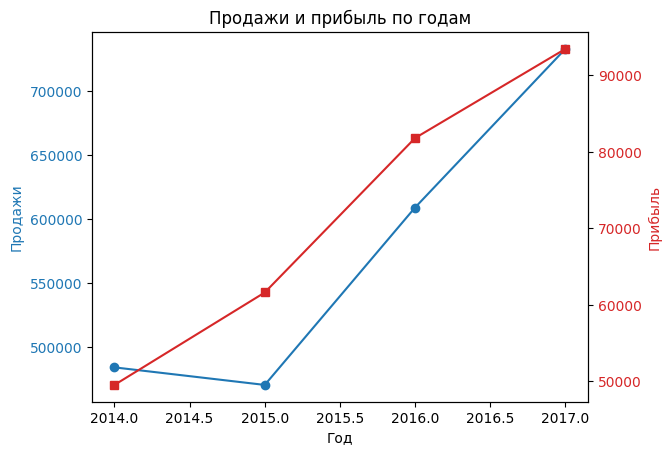
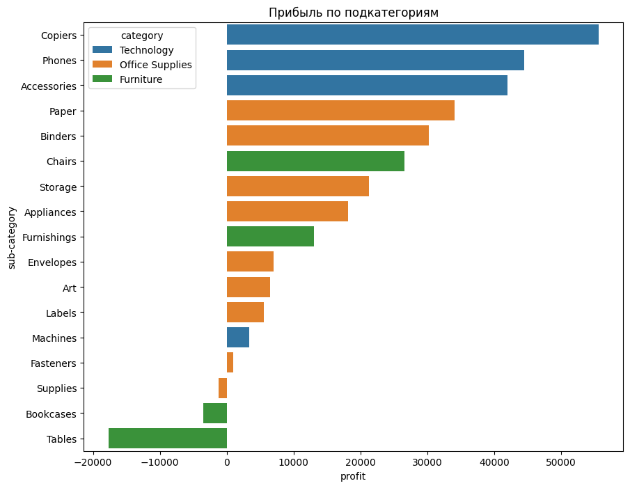
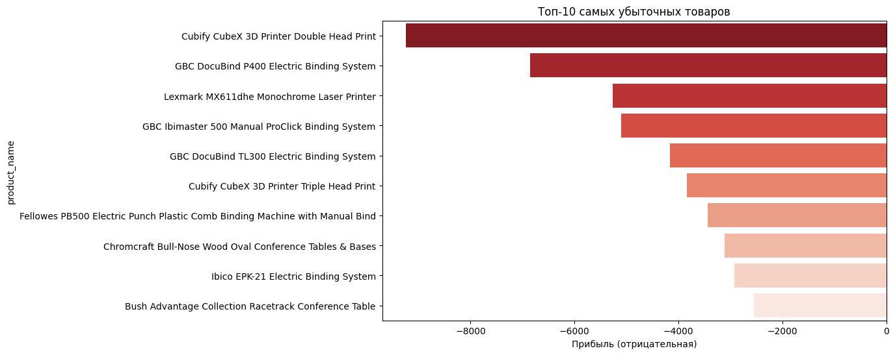
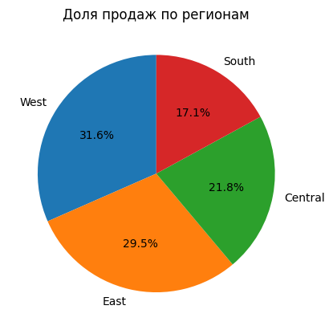

# Анализ продаж маркетплейса

Проект по исследованию открытых данных о продажах в международном интернет-магазине (Global Superstore Dataset). Цель — выявить драйверы прибыли, зоны убытков и ключевые рычаги роста.

## Что проанализировано
- Динамика продаж и прибыли по годам и месяцам  
- Прибыльность по категориям и подкатегориям  
- ТОП-10 самых убыточных товаров  
- Распределение продаж по регионам США  

## Ключевые метрики
- **Общая выручка**: $2,297,204.86  
- **Общая прибыль**: $286,397.02  
- **Рентабельность**: **12.47%**

## Основные выводы

### 1. Рост прибыли опережает рост продаж
График «Продажи и прибыль по годам» показывает:  
→ Прибыль растёт **быстрее**, чем выручка — компания улучшает маржинальность.

### 2. Лидеры по прибыли
- **Категория**: Technology  
- **Подкатегории-лидеры**: Copiers, Phones, Accessories  
- **Самая убыточная подкатегория**: Tables (часто продаются со скидкой и в убыток)

### 3. ТОП-10 убыточных товаров
Выявлены конкретные SKU, которые **систематически продаются в минус** — рекомендуется:
- Пересмотреть ценообразование  
- Исключить из ассортимента или пересмотреть закупочную стоимость

### 4. География продаж
- **West** — лидер по выручке (32.5%)  
- **South** — наименьшая доля (17.8%) → потенциал для роста

## 🛠 Используемые технологии
- Python: `pandas`, `matplotlib`, `seaborn`
- Google Colab
- Jupyter Notebook

## 📁 Данные
Источник: [Global Superstore Dataset (Kaggle)](https://www.kaggle.com/datasets/vivek468/superstore-dataset-final)  
Файл: `data/sales_data.csv`

  
  
  

